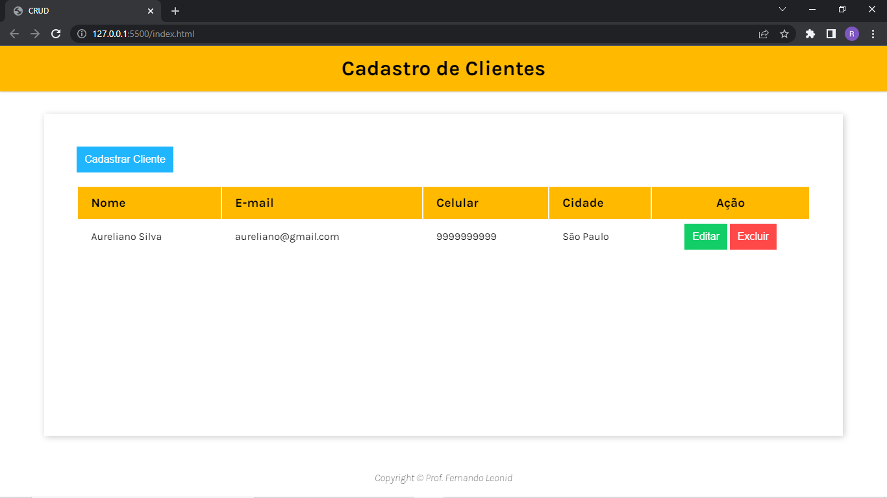

<h2 align="center"> 
  
</h2>

---
## Sobre
#### **Projeto CRUD:** Esse projeto você pode adicionar um usuário, editar as informações dos usuário, renderizar as informações do usuário na tela e deleta todas as informações dos usuários.
 
É um projeto que salva os dados dos usuários no localStorage (no navegador) mesmo que você feche o navegador e depois abrir, as informações do usuários ainda estará lá
 
 ---

 ---
## 💻 Tecnologia utilizada
 * HTML 5 
 * CSS 3
 * JAVASCRIPT